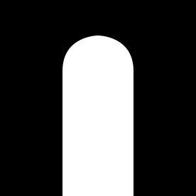

Halls
=====

<p align="center">
  
</p>

Halls is a free, open-source first-person exploration game. Players can traverse 3D spaces hosted anywhere on the internet, linked by portals that are addressed by URL. There is no objective - just portals to step through and places to see!

## Usage

Download a prebuilt binary from [Releases](https://github.com/tlonny/halls/releases). Alternatively, build from source (requires Rust stable):

```
cargo run --release
```

## Level Creation

A level is a collection of assets linked together by a `manifest.json`. The manifest schema:

```json
{
    "_version": "coco",
    "meta": {
        "name": "My Level",
        "author": "Author Name",
        "track": "Song Title - Artist"
    },
    "level": {
        "model": "mesh.glb",
        "collider": "collider.glb",
        "spawn": [0.0, 0.0, 0.0],
        "lightmap": "lightmap.png",
        "track": "music.ogg",
        "material": {
            "MyMaterial": { "image": "texture.png", "tint": [255, 255, 255] }
        }
    },
    "portal": {
        "my_portal": {
            "model": "portal.glb",
            "link": "../other_level/manifest.json#their_portal"
        }
    }
}
```

`meta.name` and `level.model` are required. Everything else is optional. If `level.spawn` is omitted, the player spawn defaults to `[0.0, 0.0, 0.0]`.

### Manifest Fields

- `meta.name`: level name shown in UI.
- `meta.author`: optional author credit shown in UI.
- `meta.track`: optional track credit shown in UI.
- `level.model`: main rendered level mesh (`.glb`).
- `level.collider`: optional collider mesh (`.glb`). If omitted, `level.model` is used for collision.
- `level.spawn`: optional player spawn position `[x, y, z]`. Defaults to `[0.0, 0.0, 0.0]`.
- `level.track`: optional background music file.
- `level.lightmap`: optional lightmap texture.
- `level.material`: optional material texture overrides keyed by glTF material name.
- `portal.<name>.model`: portal mesh (`.glb`).
- `portal.<name>.link`: relative URL to destination manifest with `#portal_name` fragment.

### Materials And Color

Materials referenced by the level model can have entries in `level.material`. A material entry can be a static texture:

```json
{ "image": "texture.png", "tint": [255, 255, 255] }
```

Or an animated texture that cycles through a series of frames:

```json
{ "images": ["frame1.png", "frame2.png", "frame3.png"], "animation_speed": 0.1, "tint": [255, 255, 255] }
```

- `tint` is optional and defaults to white `[255, 255, 255]`.
- `tint` applies to the material texture color.
- If a material has a texture in `level.material`, the model renders with that texture.
- If no texture is provided for a material, the face renders white.
- Final surface color is multiplied by the lightmap (if present).

### Texture Constraints

Texture dimensions must be one of the following sizes, each with a maximum number of textures per level:

| Size      | Max |
|-----------|-----|
| 2048x2048 | 1   |
| 1024x1024 | 4   |
| 512x512   | 8   |
| 256x256   | 32  |
| 128x128   | 64  |
| 64x64     | 256 |

### Portals

- Portal geometry can be any coplanar polygon (not just a rectangle).
- Portals must be either **wall-aligned** (vertical surface) or **floor/ceiling-aligned** (horizontal surface).
- Portal orientation is defined by a single vertex colored `MAGENTA`.
- The `link` field is a relative URL where the fragment (`#name`) identifies the destination portal name.

#### Linking Criteria

- **Wall** portals can only link to **wall** portals.
- **Floor** portals link to **ceiling** portals, and **ceiling** portals link to **floor** portals.
- Linked portals must have the same polygon shape. Shape compatibility is validated using a fingerprint.

### Tips

- Keep vertex counts low — every vertex is processed per frame.
- Avoid geometric seams — vertices that should meet must share the exact same position. Small gaps or overlaps cause collision detection issues.
- Keep portal polygons convex. Concave portal layouts surrounded by convex level geometry can cause players to snag on seams.
- Keep open space on both sides of each portal. The teleport only triggers after the player has already crossed the portal plane, so blocking geometry too close to either face can prevent crossing.
- Use a separate collider mesh for complex scenes. This also lets you include non-collidable geometry (e.g. grass, decorations) in your model without affecting physics.

## Thanks

- [JDWasabi](https://jdwasabi.itch.io/8-bit-16-bit-sound-effects-pack) — Sound effects
- [timmycakes](https://gamebanana.com/sounds/19212) — Walking sound effects
- [Jayvee Enaguas](https://www.dafont.com/pixel-operator.font) — Font
- [Ji-Hoon Myung](https://github.com/edwardmyung) - SVG logo
